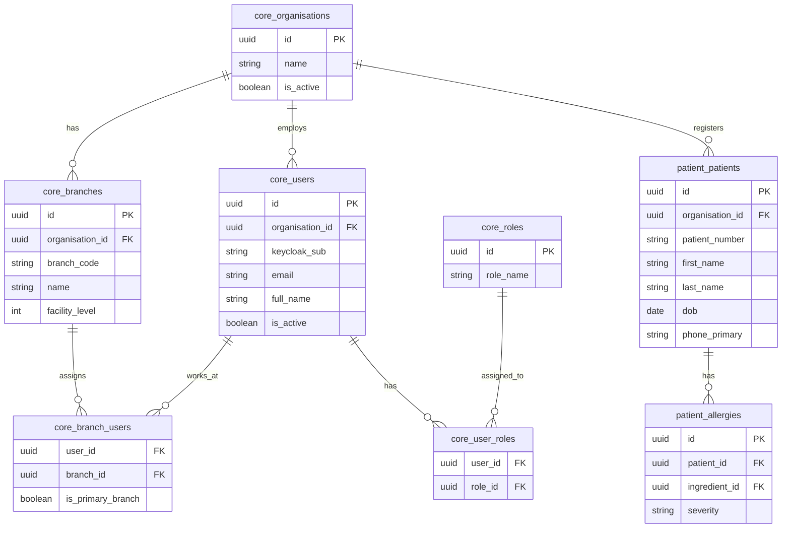
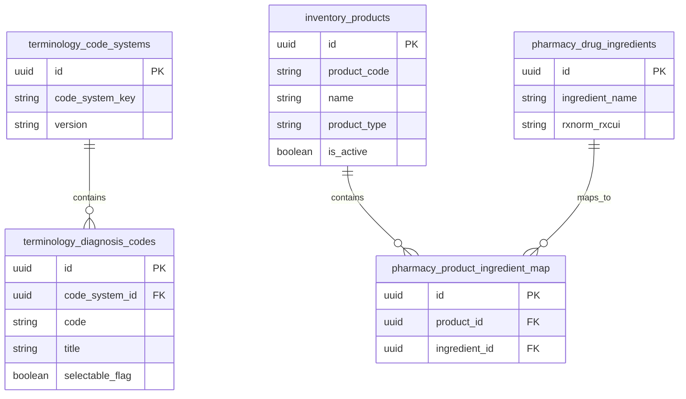
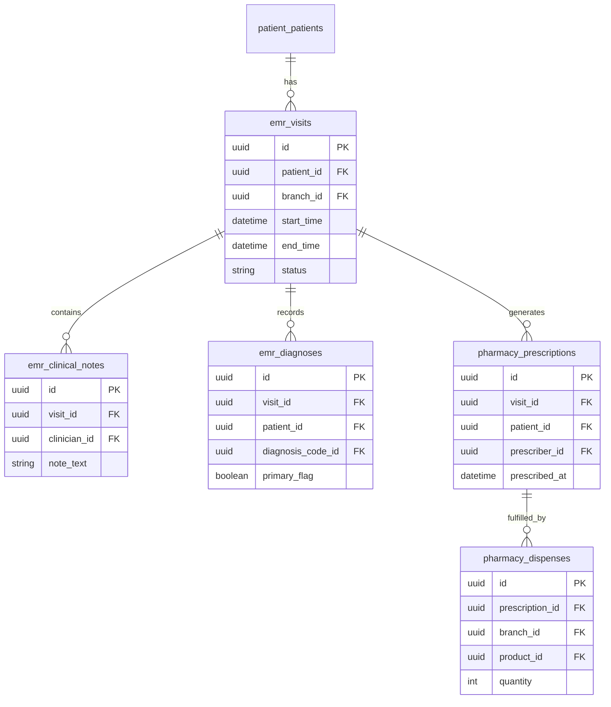
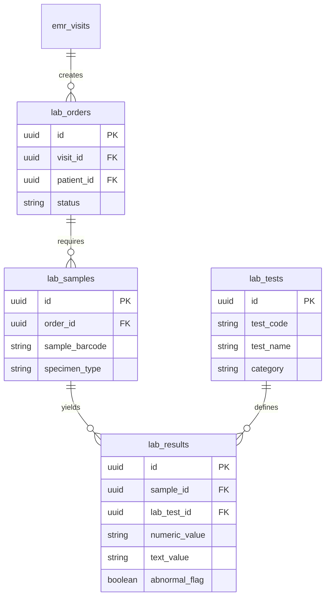
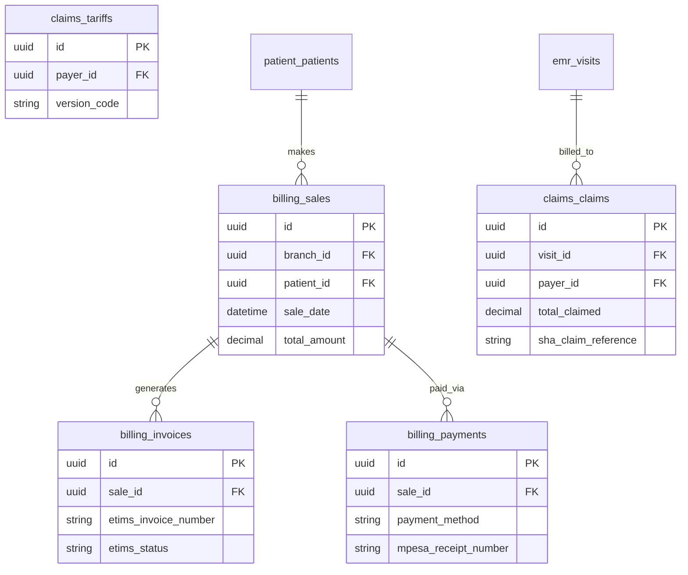
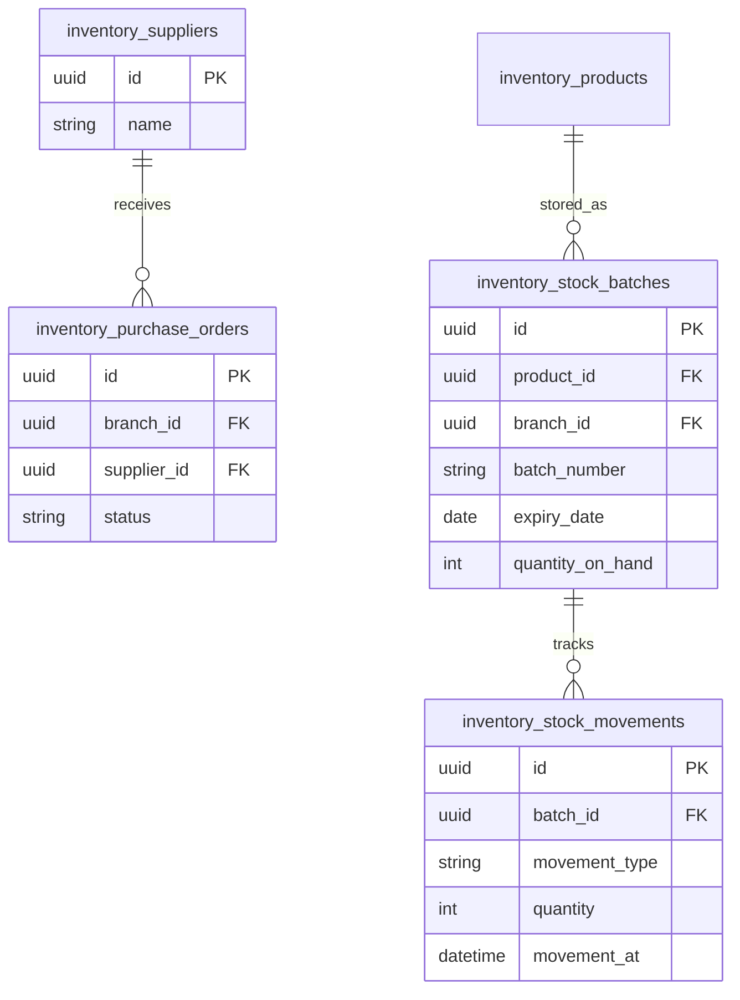

# Unified Entity Relationship Diagram (ERD)

This document provides the foundational Data Architecture for the Pzure platform. To prevent diagram rendering limits, the ERD is split by schema groups. All tables adhere to the branch-aware multi-tenancy model where applicable.

## 1. Core & Patient Schemas

## 2. Terminology & Master Data

## 3. Clinical & EMR Schemas

## 4. Lab Schema

## 5. Billing & Claims

## 6. Inventory & Supply Chain

