# Unified ERD

Single source of truth for the Pzure data model. Every table here MUST be
classified in `DOCS/tenancy-scoping.json`; the tenancy migration guard
(`scripts/check-tenancy-scoping.mjs`, ADR-001 §6.4 test 7) fails CI otherwise.

The diagram is intentionally column-light: it records the columns the tenancy
guard reasons about (primary keys, the `branch_id` column on `direct` tables,
and the FK columns that `inheritance` tables traverse to reach a branch). Full
column definitions live with each module's migration.

```mermaid
erDiagram
    core_organisations {
        uniqueidentifier id PK
    }
    core_branches {
        uniqueidentifier id PK
        uniqueidentifier organisation_id FK
    }
    core_users {
        uniqueidentifier id PK
        uniqueidentifier organisation_id FK
    }
    core_roles {
        uniqueidentifier id PK
    }
    core_user_roles {
        uniqueidentifier id PK
        uniqueidentifier user_id FK
        uniqueidentifier role_id FK
    }
    core_branch_users {
        uniqueidentifier id PK
        uniqueidentifier branch_id FK
        uniqueidentifier user_id FK
    }
    patient_patients {
        uniqueidentifier id PK
        uniqueidentifier organisation_id FK
    }
    patient_allergies {
        uniqueidentifier id PK
        uniqueidentifier patient_id FK
    }
    terminology_code_systems {
        uniqueidentifier id PK
    }
    terminology_diagnosis_codes {
        uniqueidentifier id PK
        uniqueidentifier code_system_id FK
    }
    pharmacy_drug_ingredients {
        uniqueidentifier id PK
    }
    inventory_products {
        uniqueidentifier id PK
    }
    pharmacy_product_ingredient_map {
        uniqueidentifier id PK
        uniqueidentifier product_id FK
    }
    emr_visits {
        uniqueidentifier id PK
        uniqueidentifier branch_id FK
    }
    emr_clinical_notes {
        uniqueidentifier id PK
        uniqueidentifier visit_id FK
    }
    emr_diagnoses {
        uniqueidentifier id PK
        uniqueidentifier visit_id FK
    }
    pharmacy_prescriptions {
        uniqueidentifier id PK
        uniqueidentifier visit_id FK
    }
    pharmacy_dispenses {
        uniqueidentifier id PK
        uniqueidentifier branch_id FK
    }
    lab_tests {
        uniqueidentifier id PK
    }
    lab_orders {
        uniqueidentifier id PK
        uniqueidentifier visit_id FK
    }
    lab_samples {
        uniqueidentifier id PK
        uniqueidentifier order_id FK
    }
    lab_results {
        uniqueidentifier id PK
        uniqueidentifier sample_id FK
    }
    billing_sales {
        uniqueidentifier id PK
        uniqueidentifier branch_id FK
    }
    billing_invoices {
        uniqueidentifier id PK
        uniqueidentifier sale_id FK
    }
    billing_payments {
        uniqueidentifier id PK
        uniqueidentifier sale_id FK
    }
    claims_tariffs {
        uniqueidentifier id PK
        uniqueidentifier payer_id FK
    }
    claims_claims {
        uniqueidentifier id PK
        uniqueidentifier visit_id FK
    }
    inventory_suppliers {
        uniqueidentifier id PK
    }
    inventory_purchase_orders {
        uniqueidentifier id PK
        uniqueidentifier branch_id FK
    }
    inventory_stock_batches {
        uniqueidentifier id PK
        uniqueidentifier branch_id FK
    }
    inventory_stock_movements {
        uniqueidentifier id PK
        uniqueidentifier batch_id FK
    }

    core_organisations ||--o{ core_branches : has
    core_organisations ||--o{ core_users : employs
    core_users ||--o{ core_user_roles : assigned
    core_roles ||--o{ core_user_roles : grants
    core_branches ||--o{ core_branch_users : staffs
    core_users ||--o{ core_branch_users : member
    core_organisations ||--o{ patient_patients : registers
    patient_patients ||--o{ patient_allergies : records
    terminology_code_systems ||--o{ terminology_diagnosis_codes : defines
    inventory_products ||--o{ pharmacy_product_ingredient_map : maps
    core_branches ||--o{ emr_visits : hosts
    emr_visits ||--o{ emr_clinical_notes : documents
    emr_visits ||--o{ emr_diagnoses : yields
    emr_visits ||--o{ pharmacy_prescriptions : orders
    core_branches ||--o{ pharmacy_dispenses : fulfils
    emr_visits ||--o{ lab_orders : requests
    lab_orders ||--o{ lab_samples : collects
    lab_samples ||--o{ lab_results : produces
    core_branches ||--o{ billing_sales : rings
    billing_sales ||--o{ billing_invoices : invoices
    billing_sales ||--o{ billing_payments : settles
    emr_visits ||--o{ claims_claims : submits
    core_branches ||--o{ inventory_purchase_orders : raises
    core_branches ||--o{ inventory_stock_batches : receives
    inventory_stock_batches ||--o{ inventory_stock_movements : moves
```

